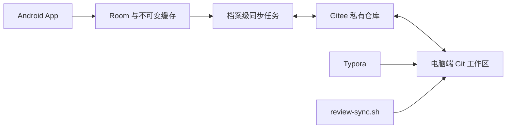

# App、Gitee 与 Typora 同步操作指南

本文说明一个档案绑定一个 Gitee 私有仓库时的日常操作、迁移和故障恢复。仓库是跨设备的不可变账本，Room 是 App 的离线投影；App 保存成功不依赖网络，后续由同一档案的同步任务异步拉取和推送。

客户端硬限制、缓存清理范围和待测性能门槛见 [同步边界与本地缓存](sync-limits-and-cache.md)。



## 仓库准备与首次绑定

1. 在 Gitee 创建私有仓库。一个仓库只服务一个档案，不要把多个档案的数据放进同一仓库。
2. 创建具备目标仓库读写权限的私人访问令牌。令牌只粘贴到 App 的仓库配置页，不写入仓库、Markdown、脚本参数或普通 Room 字段。
3. 在 App 打开“仓库配置”，选择目标档案，填写仓库所有者、仓库名、分支、固定时区和私人访问令牌。
4. 点击“测试并绑定”。空仓库会先写入 `.ebbinghaus/profile.json`、三份 v1 Schema、仓库说明和 `scripts/review-sync.sh`；已有仓库必须通过档案 UUID、仓库 UUID、时区、算法版本和 Schema 校验。
5. 根据需要开启自动同步和“仅 Wi-Fi”。连接测试不会留下临时探测文件。

固定时区决定 `YYYY-MM-DD` 目录、复习日边界和迁移日期。设备系统时区改变不会修改档案时区。需要改变档案时区时，应通过受支持的迁移流程处理，不能直接改仓库控制文件。

## 切换档案或仓库

“切换仓库”实际是选择或导入该仓库声明的档案，不能把当前档案重新指向另一个仓库。切换后：

- 当前页面只观察新档案的数据和同步状态；
- 原档案的本地笔记、checkpoint 和待推送 outbox 保持原绑定；
- 原档案的后台任务仍可使用原凭据继续同步，但不能访问新档案的数据；
- 同一仓库 UUID 已在本机绑定时，App 会切换到该已有档案，而不是创建第二份本地身份。

解除绑定不会删除本地笔记或待推送数据。解除后自动同步停止；若要把这些数据迁往其他仓库，必须使用显式迁移流程，不能修改旧 outbox 的仓库 ID。

## App 日常同步

编辑器保存完整 Markdown 快照。新增图片时，App 立即复制并计算 SHA-256，在正文光标处插入 `../assets/<sha256>.<ext>`。对历史笔记的修改会创建当天的新 revision，旧 revision 归档，新 revision 从第 1 天重新开始复习。

本地保存、复习、删除、恢复和冲突解决会在同一 Room 事务中写入业务数据与 outbox。同步任务按档案串行执行：

1. 从分支头分页拉取到上次完整应用的 commit SHA；
2. 在隔离区校验新增文件、Schema、路径、哈希、revision/event 图和资产依赖；
3. 从旧到新应用 commit，并在同一事务推进 checkpoint；
4. 将兼容的本地 outbox 合并为普通多文件 commit；
5. 校验远端 commit 的 SHA、路径和内容后才确认本地 outbox。

App 启动、档案切换、下拉刷新、本地修改和“立即同步”都会唤醒同一条流水线。配置页显示最近拉取/推送时间、远端 SHA、待推送数量、同步状态和已脱敏的错误。

配置页同时显示当前档案的 Markdown/图片缓存文件数与占用空间。“清理可重建缓存”只删除临时文件、数据库未引用文件和引用计数为零的资产；活动笔记、归档 revision、待推送数据和 Git 历史不会被删除。

同一 `YYYY-MM-DD` 目录允许多次普通 commit。任何客户端都不得 force-push、amend 已共享 commit，或修改、删除已提交的 note、asset、event 文件。

## 电脑端 Git 与 Typora

完整依赖、换行符和认证配置见 [Desktop Git and Typora Workflow](desktop-sync-workflow.md)。关键命令均在 Git Bash、Linux Bash 4+ 或现代 macOS Bash 中执行：

```bash
./scripts/review-sync.sh preflight
./scripts/review-sync.sh pull
./scripts/review-sync.sh new
./scripts/review-sync.sh revise 2026-07-20/notes/<revision-uuid>.md
./scripts/review-sync.sh validate
./scripts/review-sync.sh publish
```

Typora 可以直接阅读所有 Markdown。已提交快照只能读，不能原地编辑；更新历史笔记必须先执行 `revise`，然后编辑脚本打印的新文件。`publish` 会先安全拉取、重新校验、展示精确文件集合并请求确认，只暂存新的不可变路径，再普通提交和非强制推送。

电脑端认证使用 Git credential helper 或 SSH，不使用 App 的私人访问令牌参数。

## 冲突处理

以下冲突都会保留全部分支并暂停自动复习：

- 内容冲突：多个 revision 叶子同时存在。在 App 比较 Markdown，创建以所有叶子为 parent 的完整 merge revision；合并结果从第 1 天复习。
- 复习冲突：同一 revision 有多个 review event 叶子。选择结果后，App 创建一个以全部叶子为 parent 的 `review_merge` event。
- 删除冲突：删除、恢复或并发修订产生多个生命周期结果。选择保持删除或指定恢复 revision，App 创建显式 `lifecycle_resolve` event；旧 tombstone 和并发 revision 都保留。

若 Git 工作区本身发生合并冲突，脚本会停止。使用普通 Git 命令完成或中止当前 merge/rebase/cherry-pick/revert，再执行 `validate`。脚本也会拒绝含凭据的 HTTPS remote URL 和协议范围外的未跟踪文件。不要用强推覆盖其他设备的数据。

## 遗留数据迁移与回滚

升级检测到旧 ReviewItem/ReviewLog 数据时，必须选择一个空的目标档案和已绑定仓库。预览会：

- 把每个旧条目映射为稳定 note UUID 和初始 Markdown revision；已删除条目额外生成 lifecycle delete tombstone；
- 把 `file://`、content URI 和导入媒体复制为 SHA-256 资产；
- 把 ReviewLog 转为因果 review event；
- 对比重放后的阶段/下次复习时间与旧值；
- 报告无法读取的图片和需要人工接受的日程差异。

只有完整本地校验通过后才能排队发布。排队后旧表和原图片进入只读保护，直到远端发布完成，并从空投影执行恢复演练。恢复演练必须匹配笔记、资产、事件、生命周期和日程后，迁移才可标记完成。

首次远端发布前可执行“回滚迁移”：清空该目标档案的新投影和迁移 outbox，恢复到未改动的旧表；旧图片不会删除。远端已发布后不能用本地回滚抹除仓库历史，必须保留新格式数据并通过恢复/修订流程继续处理。

## 故障排查

| 状态或错误 | 处理方式 |
| --- | --- |
| 401/403 或“凭据需要修复” | 在配置页替换令牌并重新测试连接。旧 outbox 保留，令牌验证成功前自动重试暂停。 |
| 404 仓库/分支错误 | 核对所有者、仓库名和分支；空仓库初始化只在确认可写时执行。 |
| 409 或远端已前进 | App 会先拉取并只重试安全的追加操作；电脑端保留本地 commit，重新 pull、validate、publish。 |
| 429 或 5xx | 保留 outbox；429 优先遵守服务端 `Retry-After`，并与本地有界指数退避取较晚时间。不要重复手工创建相同文件。 |
| checkpoint 不可达 | 远端历史可能被重写。停止增量同步，检查完整树重建预览并人工确认；应用前会再次核对 branch HEAD，并以单个 Room 事务替换派生投影。 |
| Schema/哈希/路径损坏 | 错误 commit 保持隔离，checkpoint 不越过它。恢复精确字节或追加合法修复文件，不修改已提交数据。 |
| 图片尚未缓存 | 点击图片修复/同步操作；若仓库资产缺失，恢复与文件名 SHA-256 完全一致的字节。 |
| 待推送长期不变 | 查看配置页同步状态和最近错误，确认仓库仍绑定、令牌有效、网络约束满足，再执行“立即同步”。 |
| Bash 缺少时区数据 | 安装 Python `tzdata`，重新执行 `preflight`。 |
| Gradle 依赖下载失败 | 项目已优先使用阿里云 Gradle、Google、Maven Central 与插件镜像并保留官方回退；确认代理未拦截 HTTPS 后重试。 |

## 安全与诊断

- App 只在 Keystore 支持的安全存储中保存令牌，Room 仅记录 credential alias。
- 替换或清除令牌会取消使用旧 alias 的在途 HTTP 请求，不删除 outbox。
- Gitee v5 的 App REST 请求会在 GET 查询参数或 POST JSON 请求体中携带 `access_token`；App 不记录认证 URL、请求体或原始网络异常链，并会脱敏 Authorization、`access_token` 和已知令牌值。分享日志前仍应检查 Git remote、credential helper 和系统代理输出。
- 单个 v1 图片上限为 10 MiB。超限时压缩或替换原图，不能静默改变仓库中的既有资产。
- App 单轮最多发布 20 个批次；提交历史每页读取 100 条，并持续遍历到精确 checkpoint 或仓库根。真实 Gitee 请求体与限流边界仍以专用沙箱合约结果为准。

本地质量门：

```powershell
$env:ANDROID_HOME='C:\Users\rain\AppData\Local\Android\Sdk'
.\gradlew.bat test
python -m unittest discover -s tools/tests
python tools/validate_repository_format.py repository-format/v1/fixtures/valid/repository --json
bash scripts/test-desktop-sync.sh
openspec validate add-gitee-markdown-multidevice-sync
```

Compose、Keystore 和完整 App 交互测试还需要 Android 模拟器或真机。真实 Gitee 合约、App-to-App 和 App-to-desktop 验证需要专用私有沙箱仓库与测试令牌。
