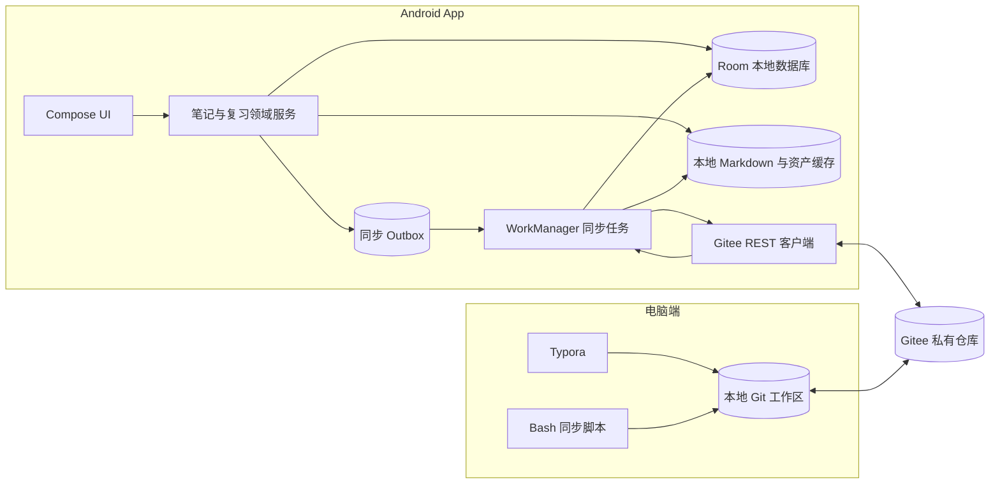
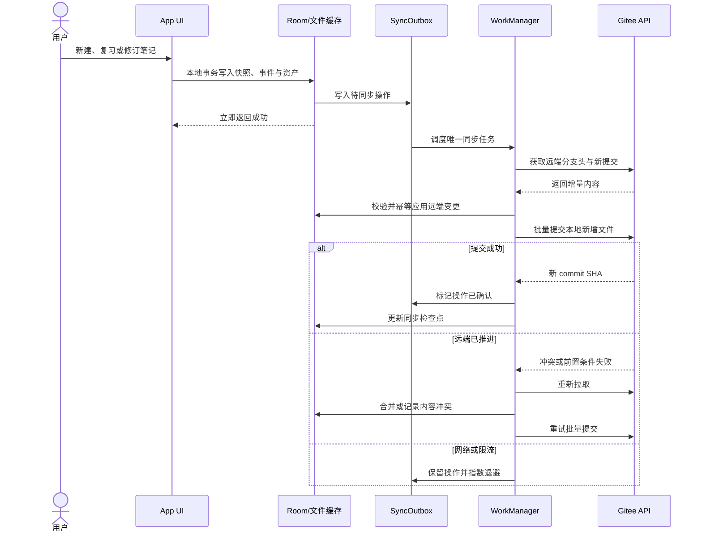
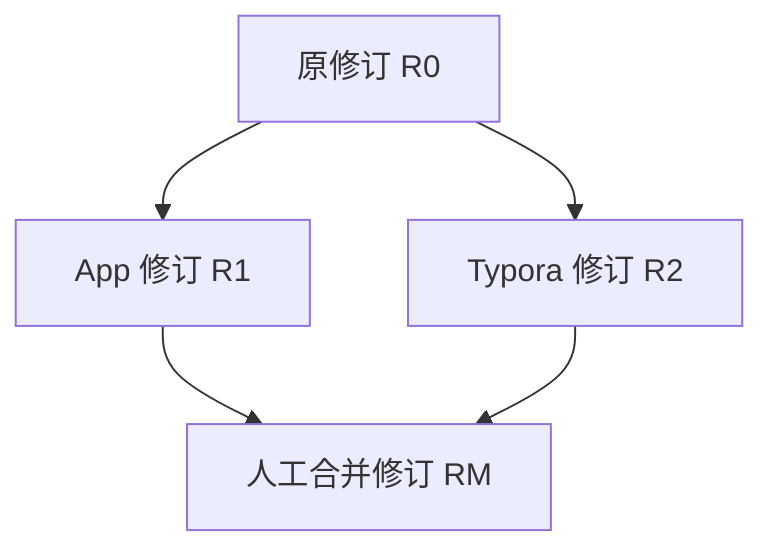

# Gitee Markdown 多端同步架构设计

> 状态：设计草案，待评审
> 日期：2026-07-22
> 范围：Android App、本地 Room 数据层、Gitee 数据仓库、Typora 桌面编辑流程、Bash 校验与提交脚本

## 1. 背景

EbbinghausReviewer 当前以 Room 作为唯一业务数据源，图片复制到 App 私有目录，复习内容由多个普通字符串字段与独立图片路径组成。现有 ZIP/JSON 导入导出属于全量备份，不具备增量同步、跨设备合并或 Git 可读性。

本设计将系统调整为：

- Gitee 私有仓库作为跨设备共享和版本审计后端；
- Room 保持 Android 端的离线运行数据库和查询缓存；
- 每个用户档案绑定一个独立 Gitee 仓库；
- 每个自然日只使用一个日期目录，但允许该目录产生多次 Git commit；
- 笔记使用 Markdown 完整快照，图片保存在同日目录的 `assets/` 下；
- 修改已有笔记不覆盖旧版本，而是归档旧版本、生成新版本，并从第 1 天重新计算复习；
- App 本地写入成功后异步拉取、合并和推送；
- 电脑端使用 Git、Typora 和 Bash 脚本进行阅读、修订、校验与人工提交。

## 2. 已确认的架构决策

| 主题 | 决策 |
|---|---|
| 云端后端 | Gitee 私有 Git 仓库 |
| 档案映射 | 一个用户档案绑定一个仓库 |
| 仓库切换 | App 支持档案/仓库切换与独立配置 |
| App 认证 | 用户在配置页粘贴 Gitee 私人访问令牌 |
| App 同步 | 本地优先，修改后尽快异步同步，失败由 WorkManager 重试 |
| 桌面同步 | Git 拉取；Typora 编辑；人工执行 Bash 脚本校验、提交和推送 |
| 日期组织 | 每天只有一个 `YYYY-MM-DD/` 数据目录，允许多次 commit |
| 历史修改 | 旧文件不原地修改；当天创建完整新快照，旧版本归档 |
| 复习排程 | 新快照视为重新学习，从第 1 天开始计算 |
| 图片 | 新快照引用的图片复制到当天 `assets/`，使用内容哈希命名 |
| 冲突原则 | 不覆盖、不强推；保留分支修订并由用户合并 |

## 3. 目标与非目标

### 3.1 目标

1. App 在无网络时完整可用，本地写入不等待 Gitee。
2. App 与电脑可以分别创建、复习和修订笔记。
3. Git 仓库中的 Markdown 可直接被 Typora 阅读。
4. 同一日期的多次修改可以产生多次普通 commit。
5. 同步可重试、可恢复、幂等，不因重复拉取或推送产生重复记录。
6. 笔记、图片、复习事件、归档和删除状态均可跨设备还原。
7. 仓库历史保持可审计，不通过强推改写已共享历史。

### 3.2 非目标

- 不实现实时协同编辑或字符级协同算法。
- 不自动合并两份同时修改的 Markdown 正文。
- 不允许直接修改已经提交的历史快照文件。
- 不将 Gitee 访问令牌写入 Git、Markdown、日志或导出包。
- 不把现有 ZIP 全量覆盖导入流程直接复用为同步协议。

## 4. 总体架构



### 4.1 数据权威性

- Room 是 Android 端的运行数据库，不是跨设备唯一真相。
- Gitee 仓库是跨设备交换、恢复和审计的规范日志。
- App 的本地修改先在 Room、文件缓存和 Outbox 中原子落盘，然后异步同步。
- 从仓库恢复时，根据不可变快照和事件重建 Room 派生状态。
- 当前复习阶段、下一次复习时间等可查询字段保存在 Room 中，但必须能由仓库内容重建。

## 5. 仓库布局

每个档案使用一个独立仓库。仓库控制文件与每日数据目录分离：

```text
repository-root/
  README.md
  .ebbinghaus/
    profile.json
    note.schema.json
    event.schema.json
  scripts/
    review-sync.sh
  2026-07-22/
    notes/
      <revision-uuid>.md
    assets/
      <sha256>.<ext>
    events/
      <event-uuid>.json
  2026-07-23/
    notes/
    assets/
    events/
```

约束：

1. 日期使用档案配置的固定时区计算，目录名固定为 `YYYY-MM-DD`。
2. 同一日期始终只有一个顶层日期目录。
3. 日期目录允许由不同设备在不同 commit 中追加新文件。
4. 已提交的 `notes/`、`assets/`、`events/` 文件不可原地修改或删除。
5. 离线设备允许稍后向过去的日期目录追加当时创建但尚未同步的唯一文件。
6. 修改旧笔记时，新修订必须写入实际修订发生日的目录，不修改原日期目录中的旧文件。
7. 不设置共享、可变的每日 `manifest.json`，避免多端同时更新同一热点文件。
8. `.ebbinghaus/profile.json` 在仓库初始化时生成，包含不可变的 `repository_id`、`profile_id`、固定时区和 schema 主版本。
9. App 绑定仓库时必须核对 `profile_id`；已有仓库只能导入为同一档案，不能静默改绑到另一个本地档案。
10. `note.schema.json` 和 `event.schema.json` 是仓库格式的机器可读约束；主版本不兼容时停止导入，兼容的小版本未知字段必须原样保留。

## 6. Markdown 笔记格式

每次创建或修订均保存一份完整 Markdown 快照。文件名使用修订 UUID，正文图片使用相对路径。

```markdown
---
schema: ebbinghaus-note/v1
note_id: 018f0000-0000-7000-8000-000000000001
revision_id: 018f0000-0000-7000-8000-000000000002
parent_revision_ids: []
revision_kind: create
authored_at: 2026-07-22T20:30:00+08:00
learning_started_at: 2026-07-22T20:30:00+08:00
source_device_id: 018f0000-0000-7000-8000-000000000003
content_sha256: <markdown-body-sha256>
---

# 示例标题

这里是支持 **Markdown** 的复习内容。


```

### 6.1 字段语义

| 字段 | 说明 |
|---|---|
| `schema` | 格式版本，用于兼容迁移 |
| `note_id` | 逻辑笔记 UUID；同一笔记的所有修订共享该值 |
| `revision_id` | 当前快照 UUID；同时作为文件名 |
| `parent_revision_ids` | 被当前版本取代的直接父修订；普通修订一个，冲突合并可有多个 |
| `revision_kind` | `create`、`restart` 或 `merge` |
| `authored_at` | 本次快照实际创建时间，包含时区 |
| `learning_started_at` | 当前修订开始第 1 天复习排程的时间 |
| `source_device_id` | 创建该修订的设备 UUID |
| `content_sha256` | front matter 结束分隔线之后全部 Markdown 字节的哈希 |

### 6.2 修订规则

- 新建笔记：生成新的 `note_id` 与 `revision_id`，`revision_kind=create`。
- 修改已有笔记：保留 `note_id`，生成新的 `revision_id`，将被取代修订写入 `parent_revision_ids`，`revision_kind=restart`。
- 修订后旧版本进入归档状态，不再参与复习排程。
- 新修订的 `learning_started_at` 等于本次修订时间，复习阶段重置为第 1 天。
- 同一正文再次保存也必须生成新修订；禁止修改已经提交的快照。
- 未提交的本地草稿可以继续编辑，首次 commit 后即成为不可变快照。

活动版本由修订图确定：没有任何子修订的节点是叶子；一个叶子表示当前活动版本，多个叶子表示内容冲突，零个叶子表示仓库损坏。父节点一旦被有效子修订引用即视为归档，不再另外维护可漂移的 `isArchived` 字段。

仓库文本统一使用 UTF-8（无 BOM）和 LF 换行。`content_sha256` 对 front matter 结束分隔线之后的原始 UTF-8 字节计算；校验器不使用标题、时间或设备本地换行规则重新序列化正文。提交前脚本会规范化未提交草稿，已经提交的文件永不重新格式化。

## 7. 图片与资产

1. App 或桌面脚本读取图片字节并计算 SHA-256。
2. 文件名使用 `<sha256>.<规范扩展名>`，避免设备路径和自增 ID 冲突。
3. 图片保存在快照创建日的 `assets/` 目录。
4. Markdown 只保存形如 `../assets/<sha256>.<ext>` 的相对路径。
5. 新修订必须在自己的日期目录中具备完整可解析的图片集合；即使图片来自旧修订，也复制到新日期的 `assets/` 路径。
6. Git 对相同内容使用相同 Blob，可在对象层复用；工作区中仍保持每个日期快照自包含。
7. 校验器必须确认引用文件存在、文件哈希与文件名一致、扩展名与实际 MIME 类型兼容。
8. Android Room 不再保存持久化 `file://` URI，改为保存资产哈希和本地缓存路径映射。
9. 同一天重复出现相同哈希时只保留一个资产文件；若远端同路径已存在，必须先核对字节哈希，一致则复用，不一致则停止同步。
10. 仓库默认限制单个资产不超过 10 MiB；超过上限时要求用户压缩或替换，不能在后台静默降质。

跨日期的完整快照会在工作区中重复出现相同资产路径，这是“每日快照自包含”的已接受存储成本；Git 对相同内容使用同一 Blob，仓库对象层不会为相同字节生成不同对象。配置页应展示仓库缓存大小并在本地缓存增长时提供安全清理，清理只影响可重新下载的本地缓存，不删除 Git 历史。

## 8. 复习事件格式

复习行为不改写 Markdown，而是在操作发生日追加独立 JSON 事件：

```json
{
  "schema": "ebbinghaus-event/v1",
  "event_id": "018f0000-0000-7000-8000-000000000010",
  "stream_id": "review:018f0000-0000-7000-8000-000000000002",
  "parent_event_ids": [],
  "event_type": "review",
  "occurred_at": "2026-07-22T21:00:00+08:00",
  "source_device_id": "018f0000-0000-7000-8000-000000000003",
  "algorithm": {
    "id": "ebbinghaus-8-stage",
    "version": 1
  },
  "payload": {
    "note_id": "018f0000-0000-7000-8000-000000000001",
    "revision_id": "018f0000-0000-7000-8000-000000000002",
    "result": "remember",
    "stage_before": 0,
    "stage_after": 1,
    "next_review_at": "2026-07-24T00:00:00+08:00"
  }
}
```

事件类型至少包括：

- `review`：记得或忘记；
- `review_merge`：人工解决同一修订上的并发复习事件；
- `delete`：在逻辑笔记生命周期流中创建 tombstone；
- `restore`：显式引用一个 delete 事件并恢复逻辑笔记。

事件文件以 `event_id` 命名并保持不可变。`stream_id` 将事件分到 `review:<revision_id>` 或 `lifecycle:<note_id>` 因果流，`parent_event_ids` 指向创建事件时已知的直接前驱。状态重放只依赖因果关系，不使用设备时间戳决定先后；`occurred_at` 仅用于日历展示和在已经确认的因果节点上计算下一次复习日期。

删除通过 lifecycle 流中的 tombstone 表达，不能只删除文件。`delete` 必须记录当时可见的活动修订，`restore` 必须把对应 delete 事件作为父事件。删除后收到的旧修订或旧复习事件仍保留作审计，但不能使笔记重新活动；只有有效的 `restore` 才能恢复。并发 delete 与 revise、并发 delete 与 restore 会形成多个 lifecycle 叶子，笔记进入 `DELETION_CONFLICT`、默认隐藏并暂停排程，等待人工生成带全部叶子为父节点的解决事件。

## 9. Android 本地数据模型

现有自增 `Long` 主键和无用户关联的数据表不能作为同步标识。建议拆分为以下逻辑实体：

| 实体 | 关键字段 | 职责 |
|---|---|---|
| `Profile` | `profileId`、名称、时区、当前状态 | 本地档案与数据隔离边界 |
| `RemoteRepository` | owner、repo、branch、credentialAlias | 档案对应的 Gitee 配置 |
| `Note` | `noteId`、`profileId`、当前修订、冲突状态 | 逻辑笔记 |
| `NoteRevision` | `revisionId`、父修订、Markdown、开始时间 | 不可变完整快照 |
| `ReviewEvent` | `eventId`、stream、父事件、结果、时间 | 可合并的因果事件流 |
| `Asset` | SHA-256、MIME、本地缓存路径 | 图片内容寻址 |
| `SyncOutbox` | 操作 UUID、batchId、依赖、日期、状态、重试信息 | 未推送的本地变更 |
| `SyncCheckpoint` | profile、branch、最后确认的 commit SHA | 幂等增量同步游标 |

所有业务 DAO 查询必须显式包含 `profileId`。切换档案时，ViewModel 取消旧档案 Flow、同步保存旧档案状态，再订阅新档案的数据流。

令牌不进入 Room 普通字段；`RemoteRepository.credentialAlias` 只引用 Android Keystore 支持的安全凭据存储。

本地领域写入和 Outbox 插入必须处于同一个 Room 事务。资产先写入临时文件、完成哈希校验并原子重命名到不可变缓存，再执行 Room 事务；事务失败留下的无引用资产由启动清理器删除。这样崩溃只会产生可清理的孤立缓存，不会产生没有 Outbox 的可见业务变更。

## 10. App 写入与同步流程



### 10.1 推送实现

App 使用 [Gitee 官方 API 文档](https://gitee.com/api/v5/swagger)中的批量提交接口：

```text
POST /v5/repos/{owner}/{repo}/commits
```

Gitee v5 的接口契约要求 GET 请求通过 HTTPS 查询参数传递 `access_token`，批量提交 POST 请求则在 JSON 请求体中传递 `access_token`；POST 请求体还包含 `branch`、`message` 和 `actions`，每个 action 使用 `path` 指定仓库路径。仓库元数据在空仓库中可能返回 `default_branch: null`，权限对象字段为 `permission`（兼容读取历史响应中的 `permissions`）。App 仅在从 Keystore 临时取出凭据后于内存中构造认证请求，不使用 `Authorization: token ...` 请求头，也不把认证 URL 或请求体写入日志、缓存、持久化数据或用户可见诊断。正常数据同步只使用 `create` action；路径为 UUID 或内容哈希，文本使用 UTF-8，二进制图片使用 Base64。更新仓库控制文件时必须提供该文件的 `last_commit_id`，不能盲写。

空仓库允许首次批量 commit 直接创建分支；仓库已有其他分支时，批量 commit 不能创建一个不存在的目标分支。此时 App 先调用 `POST /v5/repos/{owner}/{repo}/branches`，用 `refs` 指向现有默认分支并以 `branch_name` 创建目标分支，然后再提交初始化控制文件。已存在分支中的缺失 content 可能返回 `HTTP 200` 与 `null` 或空数组，transport 将其规范化为 404 语义。

单次同步将当前 Outbox 中满足依赖的 Markdown、图片和事件转换为 `actions` 数组，在一个普通 commit 中原子提交。一天允许多次同步和多次 commit。若单个笔记及图片超过批次大小上限，先用资产专用 commit 上传图片，全部确认后再提交引用它们的 Markdown；远端可以短暂存在未引用资产，但不能出现引用缺失资产的笔记。

每个网络批次在发请求前持久化 `batchId`，提交信息包含唯一 trailer：

```text
Ebbinghaus-Batch-Id: <batch-uuid>
```

只有从远端读到 commit SHA 并核对提交中的路径与内容哈希后，才能确认 Outbox。若请求超时或 App 在远端成功后崩溃，下一次同步先从远端提交历史查找相同 `batchId`；找到且内容一致则直接确认，不再创建重复 commit。相同 `batchId` 但内容不一致视为仓库损坏并停止推送。

### 10.2 拉取与检查点

- 检查点只保存已经完整应用的远端 commit SHA，不使用客户端时间作为增量游标。
- 每轮同步从分支头向后分页枚举 commit，直到找到检查点；然后按从旧到新的顺序应用。
- 每个 commit 的所有新增路径先下载到隔离目录，完成 schema、哈希、修订图和事件图校验后，再用 Room 事务更新本地状态并推进检查点。
- 同一 commit 应用中途崩溃时，检查点不推进；重跑依据 UUID 和 SHA 去重。
- 如果远端历史被强推改写导致检查点不可达，停止常规增量同步，执行完整树校验和重建预览，取得用户确认后才能替换本地派生状态。
- API 分页必须持续到检查点或仓库根提交，不能只读取第一页。

### 10.3 WorkManager 规则

- 本地变化后调度每档案唯一任务，例如 `sync-<profileId>`。
- 使用网络可用约束；用户可在配置页选择是否仅 Wi-Fi。
- 多个本地操作合并到同一轮同步，但不跨档案。
- 网络错误和限流采用指数退避；Gitee 返回 `Retry-After` 时，下一次请求不得早于服务端指定时间。
- 认证失败、仓库不存在、格式损坏属于需要用户处理的持久错误，不做无限重试。
- App 启动、切换档案、下拉刷新和手动同步均可触发一次增量同步。
- 同一档案任意时刻只允许一个同步执行器；新的触发只唤醒已有任务，不并行消费 Outbox。

## 11. 桌面 Bash 工作流

脚本文件固定为：

```text
scripts/review-sync.sh
```

建议命令：

```bash
./scripts/review-sync.sh pull
./scripts/review-sync.sh new
./scripts/review-sync.sh revise path/to/old-revision.md
./scripts/review-sync.sh validate
./scripts/review-sync.sh publish
```

### 11.1 命令职责

| 命令 | 行为 |
|---|---|
| `pull` | 要求工作区干净，执行安全拉取并校验新增数据 |
| `new` | 在当天目录创建带 UUID 和 front matter 的新 Markdown 草稿 |
| `revise` | 不改原文件；在当天目录创建未跟踪的新修订，复制资产并建立修订关系 |
| `validate` | 校验目录、YAML、UUID、修订图、JSON 事件、图片引用和哈希 |
| `publish` | 拉取、再次校验、展示 diff、确认后提交并推送 |

`publish` 必须遵守：

1. 不接受未解决的 Git 冲突。
2. 不执行 `push --force`。
3. 不提交对已跟踪快照、资产和事件的修改或删除。
4. 只暂存通过校验的日期目录数据及明确允许的控制文件变更。
5. 拉取后重新校验，避免检查与提交之间的远端变化。
6. 提交信息包含日期、设备标识和用途，例如：

   ```text
   notes(2026-07-22): publish desktop revisions from <device-id>
   ```

7. 桌面 Git 认证交给系统 Git credential helper 或 SSH 配置；脚本不接收、不打印、不保存私人访问令牌。

桌面用户可以直接用 Typora 阅读任何历史 Markdown，但不能直接编辑已经提交的快照。更新历史笔记时先执行 `revise`，再用 Typora 打开脚本输出的新草稿路径；草稿在首次 publish 前可以反复保存。若检测到已跟踪数据文件被修改或删除，`validate` 和 `publish` 必须失败，并提示用户恢复原文件后通过 `revise` 创建新版本，脚本不自动搬移或覆盖用户修改。

### 11.2 Bash 依赖

- 第一版支持 Linux、macOS 的 Bash 4+，以及 Windows 的 Git for Windows Git Bash；不支持 PowerShell 或 `cmd.exe` 直接执行；
- 必需：Bash 4+、Git 2.30+、Python 3.9+、可用的 IANA 时区数据库、`yq` v4、`jq` 1.6+；系统未提供 IANA 数据时安装 Python `tzdata` 包；
- 使用 `yq` 解析 YAML front matter、`jq` 解析事件 JSON，禁止用正则表达式替代结构化解析；
- Python 负责档案时区转换、UUID 和 Markdown 原始字节哈希；图片哈希使用 `sha256sum`，在 macOS 上兼容 `shasum -a 256`；
- 脚本启动时检查依赖并解析 `.ebbinghaus/profile.json` 中的实际时区；时区不可用时明确提示 `tzdata`，并在任何仓库变更前退出，不静默跳过任何校验。

## 12. 多端合并与冲突

### 12.1 无冲突追加

不同设备使用 UUID 生成不同文件路径。即使它们在同一天向同一目录写入，Git 通常只需要合并新增文件，不会产生文本级冲突。

### 12.2 内容分叉

如果两个设备基于同一父修订分别创建新修订，则同一逻辑笔记出现两个叶子节点：



处理规则：

1. 两个修订均保留，不自动覆盖。
2. App 将逻辑笔记标记为 `CONTENT_CONFLICT`，暂停其自动复习排程。
3. 用户在 App 或电脑端比较两份 Markdown。
4. 生成 `revision_kind=merge` 的完整新修订，`parent_revision_ids` 包含两个分支。
5. 合并修订成为修订图唯一叶子，两个父版本归档；合并修订重新开始第 1 天复习。

### 12.3 复习事件并发

- 每个复习事件具有全局唯一 `event_id`，重复拉取按 ID 去重。
- 同一修订的复习状态按 `parent_event_ids` 因果图重放，不按 `occurred_at` 排序。
- 一个事件叶子表示明确的当前排程；多个事件叶子表示设备基于同一旧状态并发复习，进入 `REVIEW_CONFLICT` 并暂停排程。
- 用户解决后生成 `review_merge` 事件，将全部冲突叶子列为父事件，并明确选择新的阶段和下一次复习时间。
- `stage_before`、`stage_after` 与 `next_review_at` 必须由算法重新计算并与事件声明核对；不合法转换被隔离，不能静默采用最后写入值。
- 内容修订发生后，旧修订的晚到复习事件保留在历史中，但不改变新修订的排程。

### 12.4 删除、恢复与并发修订

- 删除状态来自 `lifecycle:<note_id>` 事件流，不来自文件是否存在。
- 有效 delete 后，所有已有内容修订保留但不可进入活动列表或复习排程。
- restore 必须引用当前 delete 叶子，并明确选择恢复到哪个修订；恢复不会删除 tombstone。
- delete 与 revise 并发时采取保守策略：保持删除可见性、保留新修订，标记 `DELETION_CONFLICT`，等待用户选择恢复新修订或维持删除。
- 任何晚到的旧 revision、review 或 restore 都不能越过其未知的 delete 事件自动复活笔记。

### 12.5 Git 文件冲突

- App 遇到远端分支推进时先拉取再重试提交。
- Bash 脚本遇到 Git 冲突时停止，由用户处理后重新执行 `validate` 和 `publish`。
- 任何端都不得自动删除另一端的未知文件。

## 13. 仓库配置页面

每个档案的配置页面至少包含：

- 档案名称与固定时区；
- Gitee 仓库地址，或 owner/repo 分栏；
- 目标分支，默认 `main`；
- 私人访问令牌输入、替换和清除；
- 连接测试；
- 自动同步开关；
- 仅 Wi-Fi 同步开关；
- 最近成功拉取和推送时间；
- 当前远端 commit SHA；
- 待推送操作数量；
- 最近同步错误与可执行修复提示；
- 手动同步；
- 切换仓库/档案；
- 解除绑定但保留本地数据。
- 当前档案的 Markdown/图片缓存文件数与占用空间；
- 只清理临时、未引用或引用计数为零的可重建缓存，不删除活动/归档 revision、Outbox 或 Git 历史。

切换仓库前必须确保当前档案的本地事务已经完成。未推送数据不会因切换而丢失，Outbox 按档案隔离并等待下次调度。

仓库绑定流程必须先读取 `.ebbinghaus/profile.json`：空仓库可以由 App 或 Bash 脚本初始化；已有仓库只能导入其声明的 `profile_id`。更换仓库地址会创建新的绑定关系，不能把原档案的 Outbox 自动改投到新仓库。若同一 `repository_id` 已绑定到另一个本地档案，配置页只允许切换到该档案，不允许创建第二份独立数据域。

## 14. Markdown 编辑与展示

App 内部的复习内容统一为 Markdown：

- 编辑器保存 Markdown 源文本；
- 提供编辑与预览模式；
- 从相册选择图片后复制到本地资产缓存，并在光标处插入相对图片引用；
- 复习页解析 Markdown，图片引用由资产哈希解析到本地缓存；
- 缺失图片显示明确占位状态并触发同步修复，不崩溃；
- 标题可由第一个一级标题派生，Room 可保存派生标题用于列表查询，但 Markdown 正文是可移植内容。

## 15. 错误处理与安全

| 场景 | 行为 |
|---|---|
| 无网络 | 保留 Outbox，WorkManager 延迟重试 |
| Gitee 限流或 5xx | 指数退避，保留错误摘要 |
| 令牌无效或权限不足 | 停止自动重试，配置页要求更新令牌 |
| 仓库/分支不存在 | 不自动创建或切换，要求用户确认配置 |
| 远端分支推进 | 拉取、校验、合并追加内容后重试 |
| Markdown/YAML/JSON 非法 | 隔离该文件，不写入活动 Room 状态 |
| 图片缺失或哈希不符 | 隔离修订并报告确切文件路径 |
| 修订图分叉 | 保留双方，标记冲突并暂停排程 |
| 部分本地写入 | 使用 Room 事务和临时文件原子重命名回滚 |

安全要求：

- App 令牌使用 Android Keystore 支持的安全存储；
- UI 默认遮蔽令牌，不提供明文回显；
- 日志、崩溃报告和网络日志必须过滤令牌；
- 仓库默认要求私有；
- 令牌权限遵循最小权限，只允许目标仓库所需操作；
- 网络通信只使用 HTTPS；
- Bash 脚本不把凭据作为命令行参数传递。
- 替换或清除令牌时取消该档案正在执行的网络请求；已落盘 Outbox 保留，新令牌验证成功后再恢复同步。
- 令牌只在发起 HTTPS 请求时短暂解密到内存，请求结束后释放引用；HTTP 调试日志、缓存、异常链和用户可见诊断不得记录认证 URL、请求体或其中的 `access_token`。
- 连接测试只验证仓库与目标分支的最小读写权限，不创建永久测试文件；权限不足时展示 Gitee 返回的状态码和去敏错误信息。

## 16. 现有数据迁移

当前数据存在以下限制：自增 `Long` ID、图片 `file://` 路径、内容未关联用户、复习日志没有跨设备 UUID、ZIP 导入为全量覆盖。因此首次升级必须执行显式迁移：

1. 用户选择一个目标档案和 Gitee 仓库承接现有全局数据；系统不猜测旧数据属于哪个历史用户。
2. 为每个 ReviewItem 生成稳定 `note_id` 和初始 `revision_id`。
3. 将 title、description、content 转换为 Markdown 正文。
4. 读取现有图片，计算 SHA-256，复制到对应日期目录的 `assets/`。
5. 以原 `createdTime` 和档案固定时区确定初始日期目录。
6. 将现有 ReviewLog 转换为带 UUID 的事件，并映射到新修订。
7. 将当前阶段和下次复习时间与事件重放结果核对；不一致时保留迁移报告并要求确认。
8. 迁移完成并校验后再创建 Outbox，不删除旧数据库和图片。
9. 首次成功推送和恢复演练完成前，保留只读旧数据备份。

旧数据中的软删除条目也迁移为完整 Markdown revision，并追加 lifecycle delete tombstone。这样空设备恢复可以重建删除状态和审计历史，而不是依赖仅存在于旧设备的回收站标记。

## 17. 验证与测试策略

### 17.1 格式与领域测试

- Markdown front matter 合法与非法样例；
- 图片相对路径、哈希和 MIME 校验；
- 修订链拓扑、分叉和合并；
- 归档后旧版本不再进入复习排程；
- 新修订从第 1 天重新计算；
- 事件去重和确定性重放；
- tombstone 防止离线设备复活删除数据。

### 17.2 同步测试

- App 离线写入后恢复网络；
- App 与电脑向同一日期追加不同文件；
- 远端在 App 推送前推进；
- 同一父修订被两端同时修订；
- delete 与 revise、delete 与 restore 并发；
- 同一复习事件父节点被两端并发推进；
- 重复执行同一轮拉取和推送；
- 远端 commit 成功后、Outbox 确认前进程崩溃，重启后不得产生重复 commit；
- 提交历史超过一页时仍能追溯到检查点；
- 检查点因远端强推不可达时停止增量同步并进入恢复流程；
- Gitee 401、403、404、409、429、5xx；
- WorkManager 进程重启和任务重试；
- 切换档案时两个 Outbox 保持隔离。

### 17.3 Bash 脚本测试

- 使用 ShellCheck 做静态检查；
- 使用 Bats 或等价测试覆盖命令行为；
- 在 Linux、macOS Bash 4+ 和 Windows Git Bash 上运行兼容性测试；
- 工作区不干净、Git 冲突、缺少依赖时安全退出；
- Python 缺少系统 IANA 数据和 `tzdata`、档案时区键无效时安全退出且不修改工作区；
- 拒绝修改或删除已提交数据文件；
- 校验失败时不执行 commit/push；
- `publish` 拉取后再次校验；
- 多次 `publish` 可在同一天产生多个普通 commit。

### 17.4 迁移与恢复测试

- 从现有 Room 数据迁移到仓库格式；
- 从空设备仅凭仓库重建 Room；
- 图片和复习历史完整性对比；
- 大量笔记与图片的性能和内存压力；
- 中途失败后重跑迁移保持幂等。

## 18. 验收标准

1. 一个档案只能绑定一个活动仓库，多个档案数据互不串联。
2. App 业务操作只等待本地事务，不等待网络；写入成功时同一事务内必有对应 Outbox 记录。
3. 同一天始终只有一个日期目录，但允许任意数量的普通 commit。
4. 电脑可用 Typora直接阅读 Markdown，并通过 Bash 脚本安全发布。
5. 修改旧笔记会生成当天完整快照，旧版本归档，新版本从第 1 天开始复习。
6. 所有 Markdown 图片均使用仓库相对路径，空设备可以完整恢复。
7. 多端新增内容不会互相覆盖；同一笔记并发修订、并发复习或删除冲突会进入可观察的暂停状态，不产生自动复习任务。
8. App 和 Bash 均不使用强推，不改写已经共享的 Git 历史。
9. 删除、恢复和复习历史可以从事件日志重建。
10. 令牌不会出现在仓库、普通数据库字段或日志中。
11. 在自动化测试中，对同一远端 commit 范围连续执行三次同步，第二次和第三次不得新增 Room 记录、Outbox 或远端 commit。
12. 模拟远端提交成功后 App 崩溃，恢复同步必须通过 `batchId` 确认原 commit，并将 Outbox 清零。
13. 从空设备拉取仓库后，活动修订、归档、删除状态、复习阶段、下一次复习时间和图片哈希与源设备一致。
14. Bash 在任何校验失败、依赖缺失或 Git 冲突场景下以非零状态退出，且不执行 commit 或 push。

## 19. 建议实施阶段

1. 定义并冻结仓库 schema、Markdown front matter 和事件 JSON schema。
2. 实现 Bash `new/revise/validate/publish`，先用电脑仓库验证协议。
3. 迁移 Room 为档案隔离、UUID、修订和事件模型。
4. 实现 Markdown 编辑、渲染和内容寻址图片缓存。
5. 实现 Gitee 拉取、批量提交、Outbox 和 WorkManager。
6. 实现配置页、仓库切换、同步状态和冲突处理 UI。
7. 实现旧数据迁移、恢复演练和端到端多设备测试。

本设计通过后，下一步应创建正式 OpenSpec change，将仓库格式、同步行为、配置页面、Markdown 支持、Bash 工具和迁移拆分为可验证的需求与实施任务。
