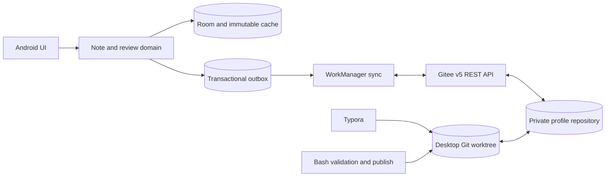

## Context

EbbinghausReviewer currently stores mutable ReviewItem rows in one Room database, copies selected images into an App-private directory, and exports active items and plans through a destructive ZIP/JSON backup path. Review items, plans, and review logs use device-local auto-increment IDs; content rows are not scoped to a user; image paths are `file://` values; and there is no synchronization protocol or Markdown representation.

The target system has two writers:

- an offline-first Android App that reads and writes Room, then synchronizes asynchronously; and
- desktop Git clients that use Typora for Markdown and a manually invoked Bash tool for safe repository updates.

Each profile owns one private Gitee repository. Multiple devices may append changes to the same date directory and may create multiple commits on the same day. Shared Git history is never force-pushed or rewritten.

The detailed protocol reference is [Gitee Markdown multi-device sync architecture](../../../docs/superpowers/specs/2026-07-22-gitee-markdown-sync-architecture-design.md).



## Goals / Non-Goals

**Goals:**

- Preserve immediate offline App writes while converging with Gitee after connectivity returns.
- Make notes and images directly readable from a cloned repository and Typora.
- Isolate every profile's Room state, credentials, outbox, checkpoint, and repository.
- Represent note changes as immutable full Markdown revisions and restart the review schedule when content changes.
- Rebuild active notes, archives, deletion state, conflicts, review history, and schedules from repository data.
- Support idempotent pull/push retries and explicit multi-device conflict states without data loss.
- Provide a Bash workflow that prevents invalid or history-rewriting desktop commits.

**Non-Goals:**

- Real-time or character-level collaborative editing.
- Automatic semantic merging of divergent Markdown bodies.
- Force-pushing or amending commits already shared through Gitee.
- Treating the legacy ZIP import/export format as the synchronization protocol.
- Storing App personal access tokens in Git, regular Room columns, command-line arguments, or logs.

## Decisions

### 1. Git is the portable ledger; Room is an offline projection

The repository is the cross-device source for immutable revisions, assets, and events. Room remains the App's optimized operational database and stores profile-scoped projections plus pending outbox entries. A fresh device can rebuild Room by validating and replaying the repository.

Alternative considered: make Room authoritative and periodically export snapshots. This was rejected because desktop edits would have no mergeable identity or event history and restore would remain destructive.

### 2. One repository per profile with an immutable repository identity

`.ebbinghaus/profile.json` records a stable repository UUID, profile UUID, schema major version, profile timezone, and immutable review-algorithm ID/version/parameters. Binding an existing repository imports its declared profile identity; "switch repository" means selecting or importing the profile bound to that repository, never retargeting the current profile or its outbox. Credentials are referenced by a Keystore-backed alias and never stored in repository data.

Alternative considered: store multiple profiles in one repository. This was rejected because it complicates privacy, switching, conflict isolation, and recovery.

### 3. Daily directories are appendable; committed data files are immutable

Repository data uses one `YYYY-MM-DD/` directory for each profile-local date:

```text
YYYY-MM-DD/
  notes/<revision-uuid>.md
  assets/<sha256>.<ext>
  events/<event-uuid>.json
```

The same date directory may receive multiple commits and late offline additions. Existing committed note, asset, and event files cannot be modified or deleted. There is no mutable daily manifest that would become a merge hotspot.

Alternative considered: exactly one commit per day. This was rejected because independent offline writers cannot guarantee one global daily commit without a single designated writer or history rewriting.

### 4. Content changes create full revision snapshots

Every logical note has a stable UUID. Each saved revision has a new revision UUID, complete Markdown content, parent revision IDs, creation time, schedule start time, device UUID, and content hash. A normal edit has one parent; a conflict-resolution merge may have multiple parents. Parents become archived when a valid child revision exists.

One revision-graph leaf means the current version. Multiple leaves mean a content conflict and pause review scheduling. A merge revision names all conflicting leaves as parents and becomes the new current revision. Every content edit or merge sets `learning_started_at` to the new revision time and restarts the Ebbinghaus schedule from day 1.

Alternative considered: modify the original Markdown file. This was rejected because it breaks daily provenance, archive semantics, conflict detection, and append-only recovery.

### 5. Images are relative, content-addressed, and snapshot-local

An asset is named by SHA-256 and stored under the revision date's `assets/`. Markdown references `../assets/<sha256>.<ext>`. A new revision copies every referenced image into its date directory so that the daily snapshot is self-contained. Equal bytes reuse Git Blob objects, though checkout paths may repeat across dates. Android stores a hash-to-cache-path mapping rather than persistent `file://` URIs.

The default per-asset limit is 10 MiB. Assets that fit the Gitee batch payload are committed atomically with their referencing note. Larger batches upload verified assets first and publish the note only after every referenced asset is confirmed remotely.

Alternative considered: a single global assets directory. This was rejected because the requested daily snapshot would no longer be self-contained.

### 6. Review and lifecycle changes use causal event streams

Events are immutable JSON files with UUIDs, stream IDs, parent event IDs, timestamps, algorithm ID/version, and typed payloads. Review payloads contain result, stage-before, stage-after, and next-review values; lifecycle payloads contain target note/revision and delete/restore ancestry. Review events belong to `review:<revision-id>` streams. Delete and restore events belong to `lifecycle:<note-id>` streams. Event state is ordered by parent edges, not wall-clock timestamps. Clients recalculate schedule fields using the immutable algorithm definition and profile timezone from `.ebbinghaus/profile.json`; unsupported algorithm versions are quarantined rather than guessed.

One event leaf is unambiguous. Multiple review leaves create `REVIEW_CONFLICT`; multiple lifecycle leaves create `DELETION_CONFLICT`. Both states pause scheduling until a user creates a merge or resolution event. A delete tombstone remains in history, and only a restore event that causally references the delete may reactivate a note.

Alternative considered: last-write-wins by `occurred_at`. This was rejected because device clocks can drift and would silently discard valid concurrent actions.

### 7. Android writes use an immutable cache plus transactional outbox

The App hashes and writes assets/revision payloads to temporary files, atomically renames them into its immutable cache, then inserts domain rows and SyncOutbox rows in one Room transaction. A failed transaction can leave only unreferenced cache files, which a startup cleaner can remove; a visible business change cannot exist without an outbox operation.

Each profile has a unique WorkManager job. Local writes enqueue or wake that job, which uses network constraints and exponential backoff. App launch, profile switch, pull-to-refresh, and manual sync can also trigger the same serialized executor.

Alternative considered: synchronous network writes from the UI. This was rejected because offline use and predictable user interactions are required.

### 8. App synchronization uses Gitee REST rather than an embedded Git client

The App uses the Gitee v5 commits, contents, tree/blob, and multi-file commit APIs. `POST /v5/repos/{owner}/{repo}/commits` creates one normal commit containing multiple `create` actions. This avoids shipping and maintaining a mobile Git worktree implementation.

Desktop clients continue to use normal Git. Their commits are valid input because the repository format, not the App outbox, defines the shared protocol.

Alternative considered: embed JGit in Android. This was rejected due to dependency size, working-tree lifecycle, credential handling, and unnecessary Git implementation complexity.

### 9. Pulls are commit-SHA based and replayed oldest first

Each profile stores the last fully applied remote commit SHA. A pull walks paginated history from branch head until that SHA, then validates and applies commits oldest first. Downloaded files remain quarantined until schema, hash, graph, and asset checks pass. Applying a commit and advancing the checkpoint occurs in one Room transaction.

If history rewriting makes the checkpoint unreachable, incremental sync stops. The App offers a full-tree validation and rebuild preview rather than guessing from timestamps.

Alternative considered: track last-sync timestamps. This was rejected because pagination, same-second commits, device clocks, and retries can cause omissions.

### 10. Pushes use persistent batch IDs for idempotency

Before a network request, the App assigns and persists a batch UUID. The commit message includes an `Ebbinghaus-Batch-Id` trailer. Outbox entries are acknowledged only after the remote commit SHA, paths, and hashes are verified.

After an ambiguous timeout or process death, the next run searches remote history for the batch UUID. A matching commit with matching contents acknowledges the batch without creating another commit. A matching batch ID with different contents is treated as repository corruption.

Alternative considered: acknowledge immediately after receiving an HTTP success. This was rejected because a process can die between Gitee accepting a commit and local acknowledgement.

### 11. Conflicts preserve all inputs and block unsafe scheduling

Unique file paths make independent additions naturally mergeable. Divergent content revisions, review event branches, and lifecycle branches are retained as separate immutable files. The App exposes conflict states and excludes them from automatic review until users resolve them. No client automatically deletes unknown files or force-pushes.

### 12. Desktop publishing is a Bash-governed workflow

`scripts/review-sync.sh` provides `pull`, `new`, `revise`, `validate`, and `publish`. Typora can read any Markdown file, but an old committed snapshot must be revised through the script into a new untracked draft. Publish rejects modified/deleted tracked data, unresolved Git conflicts, invalid schemas, missing assets, hash mismatches, and unapproved paths. It pulls and validates again before commit and push.

Version 1 targets Bash 4+, Git 2.30+, Python 3.9+, `yq` v4, and `jq` 1.6+ on Linux, macOS with a modern Bash, and Git for Windows Git Bash. Python is a non-interactive helper for IANA `zoneinfo` conversion, UUID generation, and exact UTF-8 byte hashing because Git for Windows does not ship IANA timezone data for `date`; the platform timezone database or the Python `tzdata` package supplies the IANA data. Preflight resolves the configured profile timezone before any repository mutation and names `tzdata` in its repair guidance when no usable database is available. Bash remains the entry point and orchestrator. Desktop authentication uses the user's Git credential helper or SSH configuration; the script never accepts an App token.

## Risks / Trade-offs

- **Repository growth from self-contained daily assets** -> Hash assets, rely on Git Blob deduplication, cap individual assets at 10 MiB, expose local cache size, and clean only reconstructible local cache files.
- **Gitee payload or rate limits** -> Batch within configured limits, upload assets before dependent notes when needed, use exponential backoff, and surface persistent rate-limit errors.
- **Gitee API behavior changes** -> Isolate the API behind a repository transport interface, validate capabilities during repository connection, and cover request/response behavior with contract fixtures.
- **Malformed desktop commits** -> Quarantine invalid commits/files, keep the last valid projection active, and require the Bash validator before publication.
- **Concurrent revision or event branches** -> Preserve all branches, expose explicit conflict states, and pause automatic scheduling until resolution.
- **Remote force-push by an external user** -> Detect an unreachable checkpoint, stop incremental sync, and require a full-tree rebuild preview.
- **Token exposure** -> Use Keystore-backed storage, redact request bodies and logs, cancel in-flight requests on credential replacement, and never place credentials in command arguments.
- **Migration cannot infer old user ownership** -> Require the user to choose one destination profile for the existing global dataset instead of guessing.
- **New format is a broad breaking change** -> Roll out schema/desktop validation first, keep the legacy database and images read-only during migration, and require a successful remote restore rehearsal before cleanup.

## Migration Plan

1. Freeze v1 repository profile, note, and event schemas and provide repository fixtures.
2. Implement and validate the Bash tooling against those fixtures before Android starts publishing.
3. Add UUID/profile-scoped Room entities, immutable cache tables, outbox, checkpoints, and migrations without removing legacy tables.
4. Prompt the user to select a destination profile and repository for the existing global dataset.
5. Convert each existing ReviewItem into an initial Markdown revision, convert local images to SHA-256 assets, and map ReviewLog rows to UUID events.
6. Validate event replay against the stored stage and next-review values; show a migration report for discrepancies.
7. Queue repository files only after the complete local conversion passes validation.
8. Push the migrated repository and perform a clean-device restore rehearsal.
9. Keep legacy Room tables and image directories read-only through at least one successful sync and restore cycle; remove them only in a later, separately reversible cleanup.

Rollback before first publish disables the new projection and returns to the untouched legacy tables. After repository publication, rollback must retain the repository and new tables; an older App that cannot understand the schema must not overwrite or import the new data.

## Open Questions

No product-level behavior remains unresolved. Implementation must confirm Gitee's effective batch payload, pagination, and rate-limit values against the target account before selecting transport constants; the architecture already supports bounded batches and asset-first publication, so those measurements do not change the repository contract.
